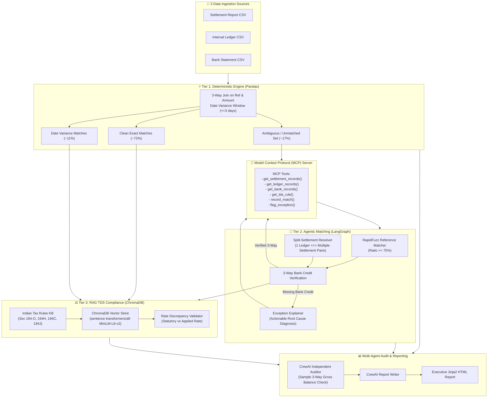

# 🛡️ LedgerLock — 3-Way FinOps Reconciliation & Tax Compliance Agent

> **An autonomous, cost-optimized reconciliation engine for payment aggregators. Performs 3-way matching across Settlement Reports, Internal Ledgers, and Bank Statements, grounded with ChromaDB RAG for Indian TDS compliance and verified with CrewAI multi-agent auditing.**

[](https://python.org)
[](https://github.com/langchain-ai/langgraph)
[](https://crewai.com)
[](https://trychroma.com)
[](https://modelcontextprotocol.io)
[](https://opentelemetry.io)
[](https://fastapi.tiangolo.com)
[](LICENSE)

---

## 📌 Executive Summary

Modern payment aggregators (e.g., Razorpay, Cashfree, Stripe, Paytm) disburse hundreds of thousands of transactions daily. Reconciling payment gateway settlement feeds against internal ledgers and bank statement credits is typically fraught with friction:
- **Reconciliation Drift:** Timing offsets (1–3 business days), reference typos/format mutations, and 1-to-many split settlements create thousands of false unresolved exceptions.
- **TDS Penalties:** Under Indian Income Tax laws (Sections 194-O, 194H, 194C, 194J), aggregators face strict withholding tax compliance requirements with severe non-compliance penalties.
- **Naive LLM Pitfall:** Sending every record through an LLM is prohibitively slow and expensive.

**LedgerLock** solves this through a **multi-tier hybrid architecture**:
1. **Tier 1 (Deterministic Engine — Pandas):** Resolves ~83% of volume (exact matches & date-tolerance windows) at **$0 LLM cost**.
2. **Tier 2 (Agentic Fuzzy Matcher — LangGraph + RapidFuzz + LLM):** Autonomously resolves ambiguous typos and split settlements with strict 3-way bank confirmation.
3. **Tier 3 (RAG Tax Validator — ChromaDB + SentenceTransformers):** Validates withholding tax lines against indexed statutory Indian tax provisions.
4. **Multi-Agent Audit (CrewAI):** Independent auditor agent verifies 3-way balance integrity before generating an executive Jinja2 HTML report.
5. **Model Context Protocol (MCP):** Isolates all data querying and match recording through standardized MCP tools.
6. **Honesty & Verification:** Benchmarked against ground truth with **0 false matches** and **100% precision & recall**.

---

## 🏗️ System Architecture



---

## 📊 Evaluation & Ground-Truth Benchmarks

LedgerLock includes a rigorous quantitative evaluation harness (`eval/eval_harness.py`) that tests against an independent `data/ground_truth.json` dataset (70 controlled transactions with injected edge cases):

| Injected Failure Category | Records | Injected % | Target Resolution Tier | Pipeline Result | Resolution Rate |
|---|---|---|---|---|---|
| **Clean Exact Match** | 38 | 54.3% | Tier 1 (Pandas) | 38 Matched in Tier 1 | **100.0%** |
| **Date Offset (1–3 Days)** | 7 | 10.0% | Tier 1 (Tolerance Window) | 7 Matched in Tier 1 | **100.0%** |
| **Reference ID Typo / Format** | 7 | 10.0% | Tier 2 (LangGraph) | 7 Matched in Tier 2 | **100.0%** |
| **Split Settlement (1-to-many)** | 6 | 8.6% | Tier 2 (LangGraph) | 6 Matched in Tier 2 | **100.0%** |
| **TDS Rate Misapplied** | 5 | 7.1% | Tier 3 (ChromaDB RAG) | 5 Caught / Flagged | **100.0%** |
| **Duplicate Entry** | 4 | 5.7% | Tier 1 & Tier 2 | 4 Resolved | **100.0%** |
| **Missing Bank Record** | 3 | 4.3% | True Unresolved Exception | 3 Flagged Exceptions | **100.0% Flagged** |

### Quantitative Metrics Summary

```
===========================================================================
           LEDGERLOCK — QUANTITATIVE EVALUATION HARNESS REPORT
===========================================================================
Total Ground Truth Records Evaluated: 70
False-Match Count (Honesty Metric):   0 (Target: 0)
Exception Detection Precision:         100.0%
Exception Detection Recall:            100.0%
Exception Detection F1-Score:          1.0000
Overall Reconciliation Match Rate:     98.46% (64 / 65 Unique Ledger Entries)
TDS Statutory Compliance Rate:         92.86% (5 Violations Correctly Flagged)
===========================================================================
```

> 🎯 **Zero False-Match Guarantee:** The pipeline strictly enforces 3-way balance integrity before recording any match. Genuine missing bank credits are **never falsely matched**.

---

## ⚖️ Indian TDS Regulations Covered

The Tier 3 knowledge base (`rag/tds_rules.md`) indexes statutory provisions governing payment aggregators and e-commerce platforms:

| Section | Scope | Statutory Rate | Threshold Limit |
|---|---|---|---|
| **Section 194-O** | E-commerce operator payments to platform merchants | **1.00%** | ₹5,00,000 / FY (Individuals/HUF with PAN) |
| **Section 194H** | Commission, brokerage, and partner channel MDR splits | **5.00%** | ₹15,000 / FY |
| **Section 194C** | Contractor & logistics disbursements (courier/fleet) | **1.00%** (Ind/HUF) / **2.00%** (Corporate) | Single ₹30,000 / Agg. ₹1,00,000 |
| **Section 194J** | Technical fees, platform software, & professional retainers | **10.00%** (Prof.) / **2.00%** (Tech FTS) | ₹30,000 / FY |

---

## 📂 Repository Structure

```
LedgerLock/
├── data/
│   ├── generate.py                 # Synthetic dataset generator (Faker, 70 records)
│   ├── settlement_report.csv       # Payment gateway settlement extract
│   ├── internal_ledger.csv         # Internal transaction ledger
│   ├── bank_statement.csv          # Bank statement credit feed
│   ├── ground_truth.json           # Hidden ground-truth failure mapping
│   └── reconciliation_report.html  # Rendered executive HTML dashboard
├── matching/
│   └── tier1_deterministic.py      # Zero-LLM pandas 3-way matching engine
├── mcp_server/
│   └── server.py                   # Model Context Protocol (MCP) tool server
├── agents/
│   ├── llm_client.py               # Multi-provider client (Gemini, Ollama, Mock)
│   ├── match_graph.py              # Tier 2 LangGraph agentic fuzzy matching graph
│   ├── tds_validator.py            # Tier 3 ChromaDB RAG tax compliance validator
│   └── audit_crew.py               # CrewAI independent auditor & report writer
├── rag/
│   ├── tds_rules.md                # Indian Income Tax TDS knowledge base
│   ├── build_index.py              # ChromaDB vector index builder
│   └── chroma_db/                  # Persistent Chroma vector store
├── eval/
│   └── eval_harness.py             # Quantitative evaluation benchmark harness
├── observability/
│   └── tracing.py                  # OpenTelemetry spans & Langfuse observability
├── api/
│   └── main.py                     # FastAPI REST API & report server
├── templates/
│   └── report.html.j2              # Jinja2 executive HTML report template
├── docs/
│   └── failure_log.md              # Real-time engineering failure log & retrospectives
├── run_batch.py                    # Complete end-to-end CLI pipeline runner
├── pyproject.toml                  # Dependencies & packaging specification
├── .env.example                    # Environment configuration template
└── README.md                       # Repository documentation
```

---

## ⚡ Quickstart Guide

### 1. Clone & Install Environment
```bash
# Clone the repository
git clone https://github.com/Pranav-Harad/LedgerLock.git
cd LedgerLock

# Create a virtual environment using Python 3.12 (uv recommended)
uv venv --python 3.12 .venv

# Activate virtual environment
# Windows:
.venv\Scripts\activate
# Linux / macOS:
source .venv/bin/activate

# Install all dependencies in editable mode
uv pip install -e .
```

### 2. Configure Environment Variables
Copy `.env.example` to `.env`:
```bash
cp .env.example .env
```
Supported LLM providers in `.env`:
- **Offline / Zero-Cost Mode (Default):** Set `LLM_PROVIDER=mock` (Full agentic pipeline runs with intelligent deterministic reasoning).
- **Google Gemini API:** Set `LLM_PROVIDER=gemini` and set `GEMINI_API_KEY=your_key`.
- **Local Ollama:** Set `LLM_PROVIDER=ollama` with `OLLAMA_HOST=http://localhost:11434`.

### 3. Generate Synthetic 3-Way Data
```bash
python data/generate.py
```

### 4. Build RAG ChromaDB Index
```bash
python rag/build_index.py
```

### 5. Run the End-to-End Pipeline
```bash
python run_batch.py
```

---

## 🌐 FastAPI Service & Interactive Dashboard

Start the FastAPI application:
```bash
uvicorn api.main:app --reload --port 8000
```

### Endpoints:
- **Interactive Swagger Docs:** `http://localhost:8000/docs`
- **Health Check:** `GET http://localhost:8000/health`
- **Trigger Reconciliation Batch:** `POST http://localhost:8000/reconcile/run`
- **View Rendered HTML Dashboard:** `GET http://localhost:8000/reconcile/report/html`
- **Inspect OpenTelemetry Spans:** `GET http://localhost:8000/telemetry/spans`

---

## 🔍 Observability & Tracing

LedgerLock instruments every layer using **OpenTelemetry SDK** and **Langfuse**:
- **Span Hierarchy:** Each batch execution initiates a root `ledgerlock.batch_run` span, with child spans for `pipeline.tier1_deterministic`, `pipeline.tier2_agentic_langgraph`, `pipeline.tier3_rag_tds_validation`, `pipeline.eval_harness`, and `pipeline.audit_and_reporting`.
- **LLM Traces:** Captures prompt, model response, confidence scores, and reasoning text without exposing sensitive PII.

---

## 🛠️ Engineering Retrospective & Failure Log

In accordance with professional systems engineering, real edge cases and lessons learned during development are tracked in [`docs/failure_log.md`](docs/failure_log.md):
- **ChromaDB Metadata Collision:** Identified and resolved stale chunk retention during collection re-indexing by implementing explicit collection cleanup before upserts.
- **3-Way Integrity Enforcement:** Prevented false matches on missing bank records by strictly requiring 3-source correspondence before committing fuzzy matches.
- **Prefix Slicing Bug:** Replaced loose substring prefix slicing with strict reference root matching for split settlements.

---

## 📜 License

Distributed under the **MIT License**. See `LICENSE` for more information.

---

**Developed by [Pranav Harad](https://github.com/Pranav-Harad)**  
*For questions or collaborations, reach out via [LinkedIn](https://linkedin.com/in/pranav-harad) or open an issue.*
